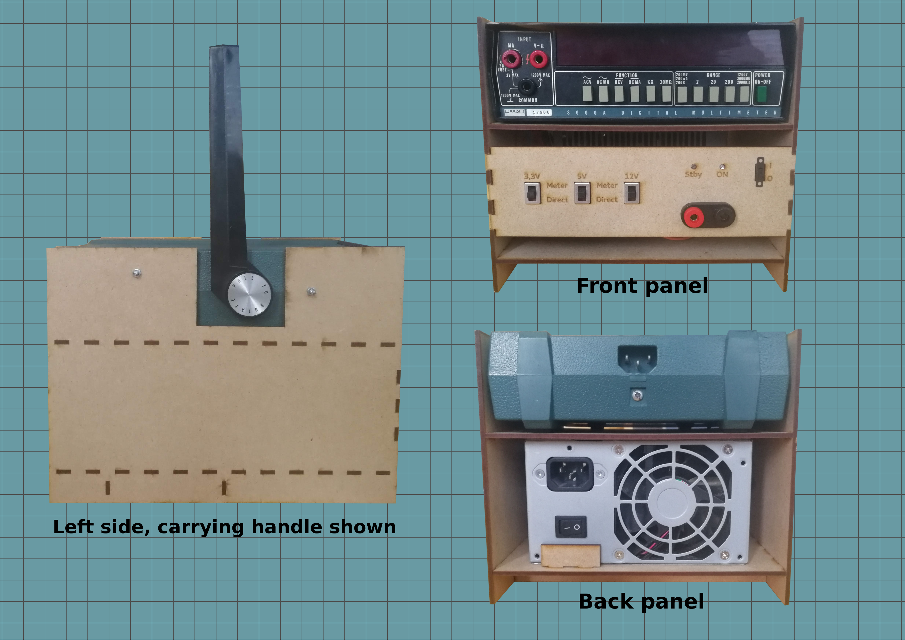

# Development notes

PoSSu is a portable, mains-operated DC voltage supply that can supply up to 350 Watts of DC power at three discrete voltage levels: +3.3V, +5V and +12V. It's based on a common ATX power supply. PoSSu also contains a digital multimeter that can be used together with the power supply to measure current, but also independently. The multimeter has been modified so that current from the power supply can be brought in directly through the meter's casing.

This project was done as a part of **Principles of repurposing of electronics (521229A)** course at University of Oulu. The main motivation for choosing this project in particular was that I wanted to utilize (read: get rid of) some of the elecronic junk that has found its way from dumpsters to my basement over the course of several years.

Converting an ATX power supply into a general-purpose DC supply is relatively straightforward and requires little to no knowledge of electronics. An ATX supply provides several set levels of DC voltage: 3.3V (orange wire) 5V (red wire) and 12V (yellow wire). A negative 12V voltage is also provided (blue wire) but it was not used in this project.

In order to get the power supply working, however, a couple of thigs need to be done. First of all, the green wire needs to be shorted to ground. The green wire is normally wired to the power button of a PC, and shorting it to ground simulates a press of a power button. Whether the pins need to be shorted only once or constantly depends on the supply. This supply required the pins to be shorted all the time, and unplugging them would immediately turn the supply off.

Secondly, to get the supply to actually supply power properly, it needs to be "deceived" to think it's been plugged to a motherboard. For this, a low-resistance resistor is used to create a dummy load on a +5V pin. **Note that this resistor will draw a lot of current, causing it to heat up. A power resistor is warmly (no pun intended) recommended.** I used an 18 ohm power resistor with a maximum power dissipation of 5 Watts. I hot-glued it directly in front of the power supply's cooling air intake to aid heat dissipation.

## Parts and components used
* 1 x ATX power supply, salvaged from a dumpster
* 1 x Fluke 8000A table-mounted, mains-operated digital multimeter, salvaged from a dumpster
* 2 x LEDs for status indicators
* 2 x **PALJONKO** ohm resistors for LEDs
* 1 x 18 ohm 5W power resistor for a dummy load on the power supply
* 1 x 2A fuse for the current going through multimeter
* 1 x 2-port banana connector jack for voltage output
* 4 x small screws and corresponding nuts for attaching the multimeter to casing
* 3mm MDF material for the casing
* Wire, capable of handling a couple amps

## Tools used
* Laser cutter
* Wire cutter
* Wire stripper
* Soldering iron and solder
* Hot glue gun

## Wires used
**Orange wire(s): +3.3V**  
Provides a DC voltage of +3.3 volts. All pins of this color are interconnected so it doesn't matter which one is chosen.  
**Red wire(s): +5V**  
Provides a DC voltage of +5 volts. All pins of this color are interconnected so it doesn't matter which one is chosen.  
**Yellow wire(s): +12V**  
Provides a DC voltage of +12 volts. All pins of this color are interconnected so it doesn't matter which one is chosen.  
**Black wire(s): Ground**  
Provides ground voltage. All pins of this color are interconnected so it doesn't matter which one is chosen.  
**Green wire: ATX power button**  
When shorted to ground, this wire turns the power supply on. In this project it's connected to a switch in the front panel.  
**Purple wire: Standby +5V**  
This pin provides a +5V voltage when the supply is plugged in, even if it's not turned on. Normally used for purposes such as wake-on-lan, in this project it's used to power the red "Stby" status LED.  
**Gray wire: Power OK**  
This pin provides a +5V voltage to signal that the power supply is turned on and working normally. In this project it's used to power the green "OK" status LED.

## Improvements for possible future revisions
* MDF is not the most fireproof material
* I used 0.1 mm of kerf on tab edges. It was a bit too much, and as a result the tabs were very tight and the case was very hard to assemble.
