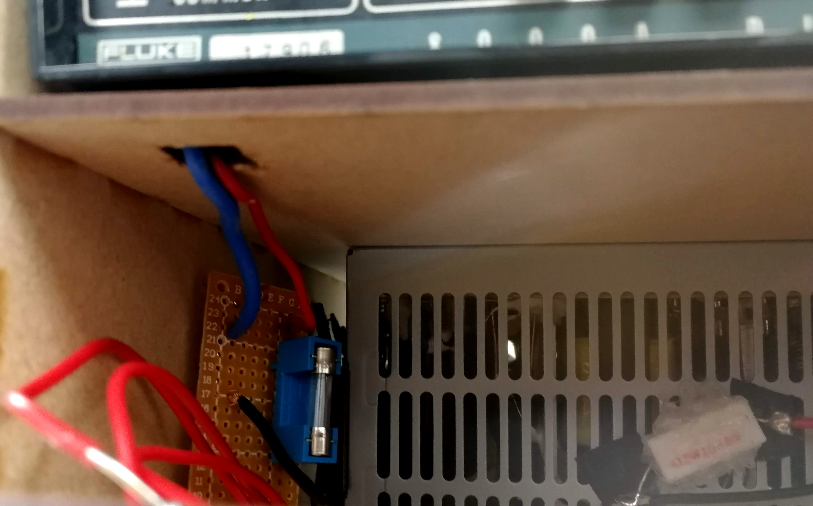
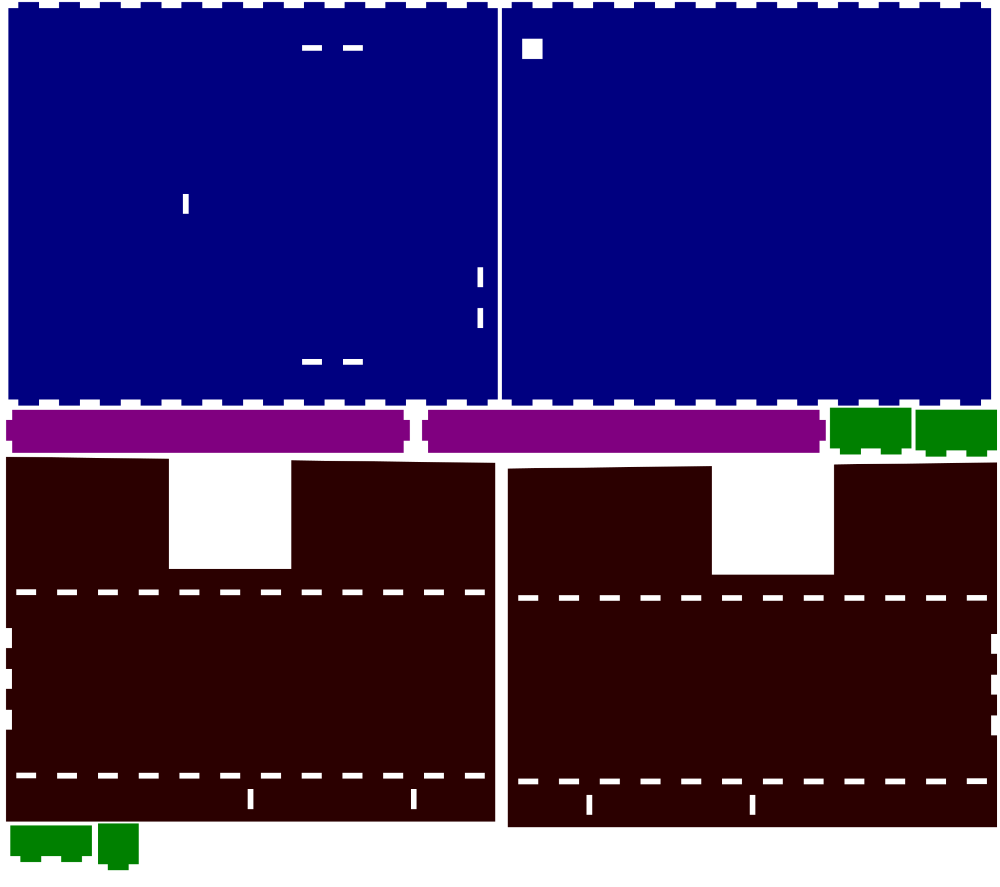
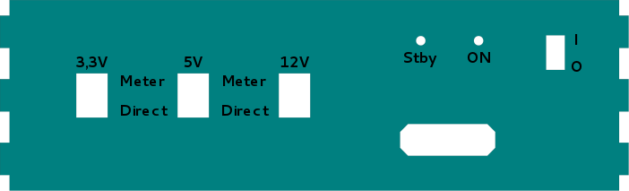

# Development notes

PoSSu is a portable, mains-operated DC voltage supply that can supply up to 350 Watts of DC power at three discrete voltage levels: +3.3V, +5V and +12V. It's based on a common ATX power supply. PoSSu also contains a digital multimeter that can be used together with the power supply to measure current, but also independently. The multimeter has been modified so that current from the power supply can be brought in directly through the meter's casing.

This project was done as a part of **Principles of repurposing of electronics (521229A)** course at University of Oulu. The main motivation for choosing this project in particular was that I wanted to utilize (read: get rid of) some of the elecronic junk that has found its way from dumpsters to my basement over the course of several years.

## Design procedure
Converting an ATX power supply into a general-purpose DC supply is relatively straightforward and requires little to no knowledge of electronics. An ATX supply provides several set levels of DC voltage: 3.3V (orange wire) 5V (red wire) and 12V (yellow wire). A negative 12V voltage is also provided (blue wire) but it was not used in this project.

In order to get the power supply working, however, a couple of thigs need to be done. First of all, the green wire needs to be shorted to ground. The green wire is normally wired to the power button of a PC, and shorting it to ground simulates a press of a power button. Whether the pins need to be shorted only once or constantly depends on the supply. This supply required the pins to be shorted all the time, and unplugging them would immediately turn the supply off. It's useful to short the pins through a switch or a button so it can be used as a power button for the device. Since my supply required continuous short, I used a 2-position slide switch, but in case it didn't, a push button might have done the thing.

*Wiring inside the casing. I truncated some wires (seen on right-hand side), but left some of them uncut so they could possibly be used for something later. I bundled them together with electric tape and placed them to the slot between the supply and casing.*

Secondly, to get the supply to actually supply power properly, it needs to be "deceived" to think it's been plugged to a motherboard. For this, a low-resistance resistor is used to create a dummy load on a +5V pin. **Note that this resistor will draw a lot of current, causing it to heat up. A power resistor is warmly (no pun intended) recommended.** I used an 18 ohm power resistor with a maximum power dissipation of 5 Watts. I hot-glued it directly in front of the power supply's cooling air intake to aid heat dissipation.

*Power resistor serving as a dummy load in the +5V pin.*

I wanted this project to be a single functioning entity instead of just gluing two gadgets together. I wanted to be able to measure current with just a press of a button, without having to run banana cables though the multimeter's panel. To solve this, I made a little hole to the multimeter's plastic casing, ran two wires through it and soldered them to pins corresponding to the meter's jacks, thus bypassing the front panel. This solution, however, also bypassed the meter's internal fuse, so an external fuse needed to be added to the wiring. The multimeter's current meter was now in series with the voltage supply, allowing user to measure current and calculate power output.

*Current meter's external input and fuse.*

The user can choose whether to bring voltage directly to output port or run it through current meter. A three-position switch controls each voltage level; in center position the circuit is open and no voltage is supplied to output port, in upper position the current meter is used, and in lower position voltage is brought directly to output port.

Despite of the two devices being connected, they can still be used independently; power can be drawn from the supply without running it through current meter, and the multimeter can still be used as a standalone meter for voltage, resistance, etc.

*Illustrative schematic of wiring*

## Parts and components used
* 1 x ATX power supply, salvaged from a dumpster
* 1 x Fluke 8000A table-mounted, mains-operated digital multimeter, salvaged from a dumpster
* 2 x LEDs for status indicators
* 2 x 460 ohm resistors for LEDs
* 1 x 18 ohm 5W power resistor for a dummy load on the power supply
* 1 x 2A fuse and a suitable socket, for the current going through multimeter
* 1 x 2-port banana connector jack for voltage output
* 4 x small screws and corresponding nuts for attaching the multimeter to casing
* 1 x small piece of wiring board to connect fuse and wires going to multimeter
* 0.3 m2 of 3mm MDF material for the casing
* Wire, capable of handling a couple amps

The only components I needed to buy were the power resistor and the fuse socket. Everything else was either second-hand or provided by the Guild's electronics club or Fab Lab Oulu.

## Tools used
* Laser cutter
* Wire cutter
* Wire stripper
* Soldering iron and solder
* Hot glue gun
* Cordless drill

## Wires used
**Orange wire(s): +3.3V**  
Provides a DC voltage of +3.3 volts. All pins of this color are interconnected so it doesn't matter which one is chosen.  
**Red wire(s): +5V**  
Provides a DC voltage of +5 volts. All pins of this color are interconnected so it doesn't matter which one is chosen.  
**Yellow wire(s): +12V**  
Provides a DC voltage of +12 volts. All pins of this color are interconnected so it doesn't matter which one is chosen.  
**Black wire(s): Ground**  
Provides ground voltage. All pins of this color are interconnected so it doesn't matter which one is chosen.  
**Green wire: ATX power button**  
When shorted to ground, this wire turns the power supply on. In this project it's connected to a switch in the front panel.  
**Purple wire: Standby +5V**  
This pin provides a +5V voltage when the supply is plugged in, even if it's not turned on. Normally used for purposes such as wake-on-lan, in this project it's used to power the red "Stby" status LED.  
**Gray wire: Power OK**  
This pin provides a +5V voltage to signal that the power supply is turned on and working normally. In this project it's used to power the green "OK" status LED.  

Rest of the wires can be truncated using wire cutters. A few wires can be left uncut for possible future use.

## Casing
Casing of the device is cut with a laser cutter from 3mm thick MDF panel.

*Illustration of the casing, excluding front panel  
**Blue:** Floors (left: bottom, right: top)  
**Red:** Sides  
**Green:** Support pieces that surround the power supply and keep the it in place  
**Purple:** Support beams that are located directly below the power supply to support its weight*

  
*Illustration of the front panel*

## Warnings
* This design comes with ABSOLUTELY NO WARRANTY. Only consider forking this project if you know what you are doing.
* Only ONE voltage level may be switched to output (out of center position) at a time. Switching two switches simultaneously out of center position will result in a short circuit that will most likely fry the power supply or at least blow its fuse (provided it has one). Since I did not implement a protection mechanish for this, it's the user's responsibility to ensure only one voltage level is switched to output at a time. Always double-check the switches before turning them.
* MDF is made of wood and is therefore not fireproof. As there are some exposed wires inside the casing, a risk of a high-current short circuit exists. I would advise that you never leave the device unattended when it's plugged in.
* The resistor used as a dummy load will run hot, so keep it away from any wooden parts, e.g. the casing.
* If you truncate excess wires, be sure to shield their open ends with e.g. electric tape to avoid short circuits.

## Improvement suggestions for possible future revisions
* MDF is not the most fireproof material, so you might consider using something else for the casing. A transparent material such as acrylic might be cool and even helpful for troubleshooting.
* I used 0.1 mm of kerf on tab edges. It was a bit too much, and as a result the tabs were very tight and the case was very hard to assemble. If you plan on using my documents, use a little less kerf.
* Short circuit protection mechanism. A stepped rotary switch would do the trick.
* Both the supply and the multimeter require mains power. Carrying two power cords and using two wall outlets is a little unwieldly, but you might consider getting a C13 power cord splitter. The multimeter only consumes about 5W of power, so it should not be a problem.

## What I learned
During this project I learned a lot about the nature and behavior of ATX power supplies. Previously I had never put much thought on what kind of voltages they provide, and I was surprised how straightforward the conversion procedure was overall.

During design I referred to these articles for advice:
https://www.electronics-tutorials.ws/blog/convert-atx-psu-to-bench-supply.html
https://www.instructables.com/id/ATX--%253e-Lab-Bench-Power-Supply-Conversion/

Prior to this project I had no experience or knowledge on laser cutting. Designing a complex casing from scratch seemed more or less like black magic to me. After watching a couple tutorials on YouTube I installed Inkscape and started to sketch my casing. Overall it took me about 5 hours to design and draw the casing and one hour to cut and assemble it. The staff of Fab Lab Oulu helped me get started with the cutting.
